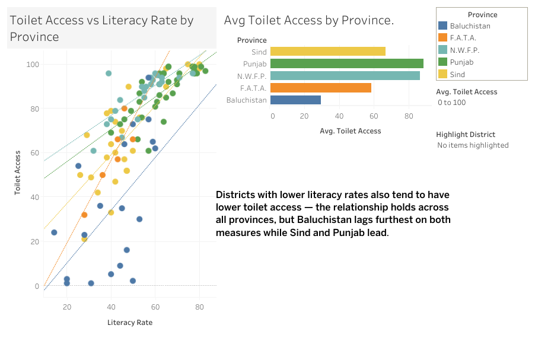

# Pakistan District Socioeconomic Patterns: A Spatial EDA

A GIS-based exploratory analysis of literacy and sanitation access across Pakistan's 141 districts, using open government survey data (PSLM 2019-20) mapped against real administrative boundaries — including a data-quality investigation into cross-source naming inconsistencies, two choropleth maps, a correlation analysis, and a distance-from-major-city spatial test.

This project extends the GIS/data science skills developed in my [Nepal earthquake EDA](../nepal-earthquake-eda) — specifically moving from point-based mapping (earthquake epicenters) to polygon-based choropleth mapping, coordinate reference system handling, and geometric distance analysis.

## Key findings

- **Literacy and toilet access are strongly correlated across districts (r = 0.75)** — but the relationship is far tighter above ~70% literacy than below ~50%, where districts with similar literacy show wildly different sanitation outcomes, meaning literacy alone doesn't determine infrastructure at the lower end.
- **Baluchistan shows a real, well-documented gap** between education and sanitation — literacy sits in a moderate 20–60% range across the province, but toilet access is consistently far lower (often under 30%), even after ruling out thin data coverage as the explanation. Pakistan's official "Flush" toilet definition includes pit-connected pour-flush systems, raising an open question about whether this reflects genuinely dry sanitation or a definitional/reporting gap in these remote districts.
- **Distance from a major city is a real but secondary predictor** of both literacy (r = -0.48) and toilet access (r = -0.41) — weaker than literacy and toilet access predict each other, suggesting general district development matters more than raw geographic remoteness.
- **A significant, honestly-documented data-quality journey:** three unrelated data sources (boundary shapefile, two separate government surveys) needed a name-based join with no shared ID system, requiring two independently-built rename maps after discovering the two surveys sometimes spell the same district differently *from each other*, not just from the boundary file.
- **A real geometry defect was found and documented:** five coastal districts (including two in Karachi with strong underlying data) have malformed boundary geometry inherited from the open-source shapefile, excluding them from both maps and the distance analysis — a genuine data-limitation, not a data-quality error introduced by this analysis.

## GIS skills demonstrated

Polygon geometry and choropleth mapping · Coordinate Reference System (CRS) reprojection (EPSG:4326 → EPSG:32642 for metric distance) · Centroid calculation · Point-to-polygon distance measurement · Geometry validity diagnosis and repair · Cartographic handling of missing spatial data

## Repository contents

| File | Description |
|---|---|
| `PK_DIS_full.ipynb` | Full analysis notebook |
| `literacy.csv` / `toilet.csv` | PSLM 2019-20 district-level survey exports |

## Data sources

- District boundaries: [pakdata/gisdata](https://github.com/pakdata/gisdata) (GeoJSON, GADM-derived)
- Literacy and toilet access: [PSLM 2019-20 District-Level Dashboard](https://pslm-sdgs.data.gov.pk/districtlevel), Pakistan Bureau of Statistics

## Method

Same hypothesis-first discipline as my Nepal project: each analytical question is stated and dated before running any code, followed by evidence and an honest conclusion — including cases where an initial assumption (e.g. that 0% toilet-access figures indicated real conditions) was revised after further investigation, and one hypothesis (distance as a strong predictor) confirmed only directionally rather than strongly.

## Tech stack

Python · pandas · GeoPandas · matplotlib · Jupyter

## About me

Geoscientist (MSc Geo-Environmental Resources and Risks, University of Camerino) transitioning into data science and GIS, targeting the Swedish job market. This project was built specifically to close a skill gap identified after my first portfolio project (Nepal earthquake EDA): choropleth mapping, CRS handling, and spatial distance analysis.

## Possible next steps

- Replace the coastal-geometry-affected boundary source with the official HDX/OCHA administrative boundaries
- A true geometry-based spatial join (e.g. `gpd.sjoin`) rather than the attribute-based name join used here
- Incorporate a "Non-Flush" sanitation breakdown to resolve the open question around Baluchistan's low flush-toilet figures

## Interactive Dashboard

*Districts with lower literacy rates also tend to have lower toilet access — the relationship holds across all provinces, but Baluchistan lags furthest on both measures while Sind and Punjab lead.*

🔗 View the interactive version on Tableau Public: https://public.tableau.com/app/profile/ma056/viz/PakistanLiteracyvsSanitationAccessbyProvince/PakistanLiteracyvsSanitationAccessbyProvince